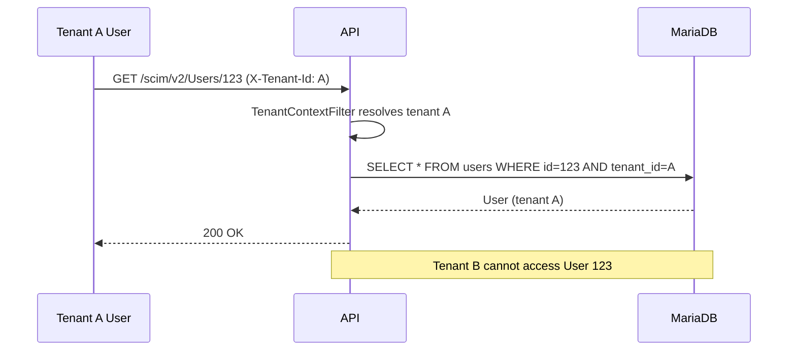
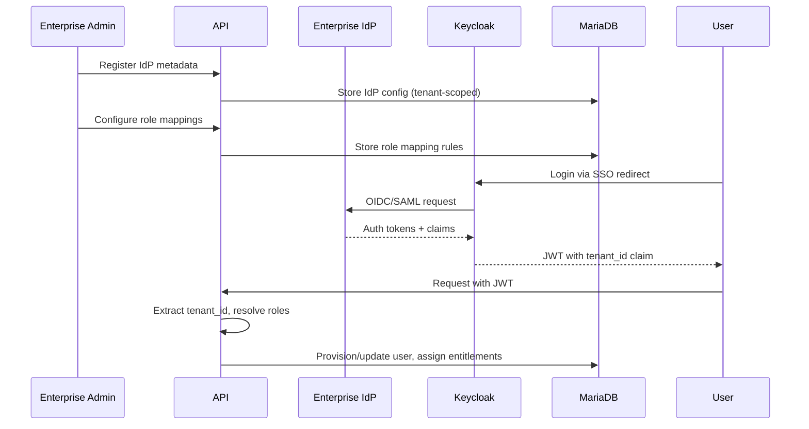

# Identity Entitlement Broker

**Enterprise multi-tenant identity and entitlement broker for B2B SaaS.**

SSO onboarding, SCIM-style provisioning, role mapping, OPA policy decisions, tenant isolation, and full audit—designed for enterprise sales readiness.

## Business Problem

Enterprises buying B2B SaaS expect:

- **SSO** (OIDC or SAML) on day one
- **SCIM provisioning** so they don't manually manage users
- **Role mapping** from their IdP claims/groups to your internal roles
- **Fine-grained entitlements** controlling product access per user or group
- **Audit trails** showing every identity, policy, and entitlement change
- **Tenant isolation** so one customer can never see another's data

Building this per-customer is expensive and insecure. The Identity Entitlement Broker is a **reference architecture** that solves all six requirements in a single, composable system.

## Stakeholder Map

| Stakeholder | Concern |
|---|---|
| **Enterprise Admin** | SSO onboarding, SCIM sync, role mapping, entitlement management |
| **IdP Operator** | OIDC/SAML configuration, claim mapping, JWKS verification |
| **Application Developer** | Policy decision API, tenant context, entitlement resolution |
| **Security Auditor** | Immutable audit log, cross-tenant isolation, policy evidence |
| **Compliance Officer** | SOC2/ISO27001 evidence, access reviews, incident response runbooks |

## Architecture Overview

```
┌─────────────┐     ┌──────────────┐     ┌─────────────┐
│  Admin UI   │────▶│  API         │────▶│  MariaDB    │
│  (Vue 3)    │     │  (Quarkus)   │     │  (Identity) │
└─────────────┘     └──────┬───────┘     └─────────────┘
                           │
┌─────────────┐     ┌──────┴───────┐
│  Enterprise │     │  OPA         │
│  IdP (OIDC/ │◀────│  (Policy)   │
│  SAML)      │     └──────────────┘
└─────────────┘
                           │
┌─────────────┐     ┌──────┴───────┐
│  SCIM       │────▶│  Keycloak    │
│  Client     │     │  (Auth)      │
└─────────────┘     └──────────────┘
```

### Core Components

| Component | Technology | Purpose |
|---|---|---|
| **API** | Java 17 + Quarkus 3.x | REST endpoints, tenant isolation, SCIM, entitlements, policy decisions |
| **Auth** | Keycloak 26.x (local dev) / external IdP (production) | OIDC token issuance, JWT with tenant claims |
| **Policy Engine** | OPA 1.x (Rego) | Externalized, testable authorization policies |
| **Database** | MariaDB 11.4 | Tenant-scoped identity, entitlement, and audit data |
| **Admin UI** | Vue 3 + Vite | Dashboard for tenant, IdP, user, group, role, entitlement, policy, audit management |
| **Identity Providers** | OIDC / SAML (configurable) | External enterprise IdP connections with metadata registry |

## Quick Start

### Prerequisites

- Docker & Docker Compose
- Java 21+ (JDK)
- Maven 3.9+
- Node.js 20+
- OPA CLI (for policy testing)

### Local Setup

```bash
# Clone and enter
cd identity-entitlement-broker

# Start infrastructure
docker compose up -d mariadb opa keycloak

# Wait for services to be healthy
./tests/smoke/smoke-test.sh

# Start the API (dev mode)
cd apps/api && mvn quarkus:dev

# In another terminal, start the frontend
cd apps/web && npm install && npm run dev
```

### Common Commands

```bash
make setup     # Install all dependencies
make dev       # Start full stack
make test      # Run all tests
make lint      # Lint all code
make build     # Build all artifacts
make smoke     # Run smoke tests
make clean     # Clean all build artifacts
```

## Identity Architecture

### Tenant Isolation Model

Every API request resolves the caller's tenant from the JWT `tenant_id` claim (or `X-Tenant-Id` header in dev mode). All domain entities carry a `tenant_id` FK. A `TenantContextFilter` intercepts every request and validates that any accessed resource belongs to the caller's tenant. Cross-tenant access returns HTTP 403 with a structured error and an audit event.



### SSO Onboarding Flow

1. Enterprise admin registers their IdP via `POST /api/v1/tenants/{id}/idp`
2. System stores IdP metadata (issuer, JWKS URI, SSO URL) — *never raw secrets*
3. Enterprise user clicks "Login with SSO"
4. Browser redirects to IdP → IdP authenticates → callback with OIDC tokens
5. Keycloak validates token, extracts `tenant_id` claim
6. API resolves tenant context, provisions user via SCIM if first login
7. Roles mapped from claims/groups via `RoleMapping` rules
8. Entitlements resolved → user can access assigned products



### SCIM-Compatible Provisioning

The broker exposes SCIM 2.0-shaped endpoints for user and group provisioning:

| Endpoint | Method | Purpose |
|---|---|---|
| `/scim/v2/Users` | POST | Create user |
| `/scim/v2/Users/{id}` | GET | Get user |
| `/scim/v2/Users/{id}` | PATCH | Update user |
| `/scim/v2/Users/{id}` | DELETE | Deactivate user |
| `/scim/v2/Groups` | POST | Create group |
| `/scim/v2/Groups/{id}` | GET | Get group |
| `/scim/v2/Groups/{id}` | PATCH | Update group |
| `/scim/v2/Groups/{id}` | DELETE | Delete group |

Responses include `schemas`, `meta`, and standard SCIM attributes. See `contracts/openapi/openapi.yaml` for full schemas.

### Role Mapping Model

Role mappings translate external identity attributes to internal roles:

| Source Type | Source Value | Target Role | Priority |
|---|---|---|---|
| `OIDC_CLAIM` | `groups: ["admin"]` | `super-admin` | 100 |
| `SAML_ATTRIBUTE` | `Role = "Engineer"` | `developer` | 50 |
| `SCIM_GROUP` | `Engineering` | `developer` | 50 |

Resolution is priority-based: higher priority wins when multiple mappings match.

### Entitlement Resolution Model

```
User
 ├── Direct Entitlement Assignments
 │    └── Product: Identity Core → Entitlement: Admin
 └── Group Entitlement Assignments
      └── Group: Engineering → Product: Access Manager → Entitlement: User
           └── Product: Audit Trail → Entitlement: Viewer

Result: Union of all → {Identity Core: Admin, Access Manager: User, Audit Trail: Viewer}
```

### Policy Decision Model

Policy decisions use OPA (Open Policy Agent) with Rego rules:

```rego
package identity

default allow = false

allow {
    input.action == "access"
    role_has_entitlement
}

allow {
    input.action == "manage"
    input.roles[_] == "super-admin"
}

allow {
    input.action == "impersonate"
    input.roles[_] == "super-admin"
}

allow {
    input.action == "provision"
    input.roles[_] == "super-admin"
}
```

### Audit Model

Every identity, policy, and entitlement action creates an immutable audit event:

```json
{
  "id": "uuid",
  "tenant_id": "uuid",
  "actor_id": "user@example.com",
  "action": "entitlement.assigned",
  "resource_type": "EntitlementAssignment",
  "resource_id": "uuid",
  "outcome": "SUCCESS",
  "correlation_id": "uuid",
  "created_at": "2026-07-02T21:00:00Z",
  "metadata_json": "{\"entitlement_name\": \"Identity Admin\"}"
}
```

## Repository Structure

```
identity-entitlement-broker/
├── apps/
│   ├── api/                    # Quarkus Java API
│   │   ├── src/main/java/com/identitybroker/
│   │   │   ├── domain/         # JPA entities
│   │   │   ├── api/rest/       # REST resources
│   │   │   ├── api/dto/        # Request/response DTOs
│   │   │   ├── application/    # Business services
│   │   │   └── infrastructure/ # DB, security, policies, audit
│   │   └── src/test/java/      # Integration tests
│   └── web/                    # Vue 3 admin dashboard
├── policies/opa/               # OPA Rego policies + tests
├── contracts/openapi/          # OpenAPI 3.1 specification
├── docs/
│   ├── architecture/           # Architecture decision records
│   ├── adr/                    # ADRs
│   ├── runbooks/               # Operational runbooks
│   └── diagrams/               # Mermaid diagrams
├── examples/
│   ├── scim/                   # SCIM request/response examples
│   └── sso/                    # IdP configuration examples
├── infra/local/                # Local infrastructure config
├── tests/smoke/                # End-to-end smoke test
├── docker-compose.yml
├── Makefile
└── .env.example
```

## Verification

```bash
# Run the full smoke test
bash tests/smoke/smoke-test.sh

# Or verify individual components
curl http://localhost:8081/health
curl http://localhost:8081/ready
curl http://localhost:8081/version

# Test tenant isolation
# (works after seeding or creating tenants)
curl -s -H "X-Tenant-Id: <tenant-a-id>" http://localhost:8081/api/v1/tenants | jq .
curl -s -H "X-Tenant-Id: <tenant-b-id>" http://localhost:8081/scim/v2/Users/<user-a-id> -w "\nHTTP %{http_code}\n"
# Expected: 403
```

## Enterprise Scaling Notes

- **API scale**: Horizontal replicas behind a load balancer. Stateless — no session affinity needed.
- **Database**: MariaDB read replicas for audit queries. Connection pooling via Agroal (Quarkus default).
- **OPA**: Deploy as sidecar or dedicated cluster. Evaluate caching decisions with OPA's built-in caching.
- **Keycloak**: Cluster with Infinispan distributed cache for session replication.
- **Audit storage**: Partition audit_events by month. Archival to object storage after 90 days.
- **Multi-region**: Deploy per-region stack with global tenant routing via DNS or API gateway.

## Security Trade-offs

| Trade-off | Decision | Rationale |
|---|---|---|
| Dev auth header | `X-Tenant-Id` + `X-Actor-Id` for dev only | Eliminates OIDC dependency in dev/test. MUST be disabled in production (`DEV_AUTH_ENABLED=false`). |
| Secret storage | References only (e.g., `vault://secrets/...`) | No raw secrets in DB. Real deployments should integrate with Vault, AWS Secrets Manager, etc. |
| OPA integration | REST call per decision | Separate policy evaluation from application. For high-throughput, consider sidecar deployment with caching. |
| SCIM compliance | Compatible shape, not full spec | Enterprise buyers verify SCIM support exists. Documented deviations. Full compliance requires SCIM-specific middleware. |
| Tenant isolation | Application-level enforcement | Consistent across all services without DB-level row security. Works with any SQL database. |

## License

MIT — see LICENSE.
