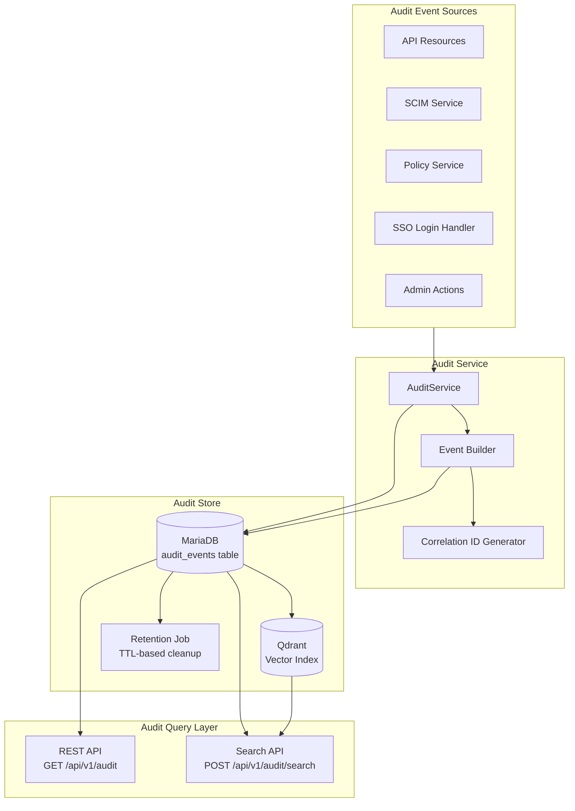
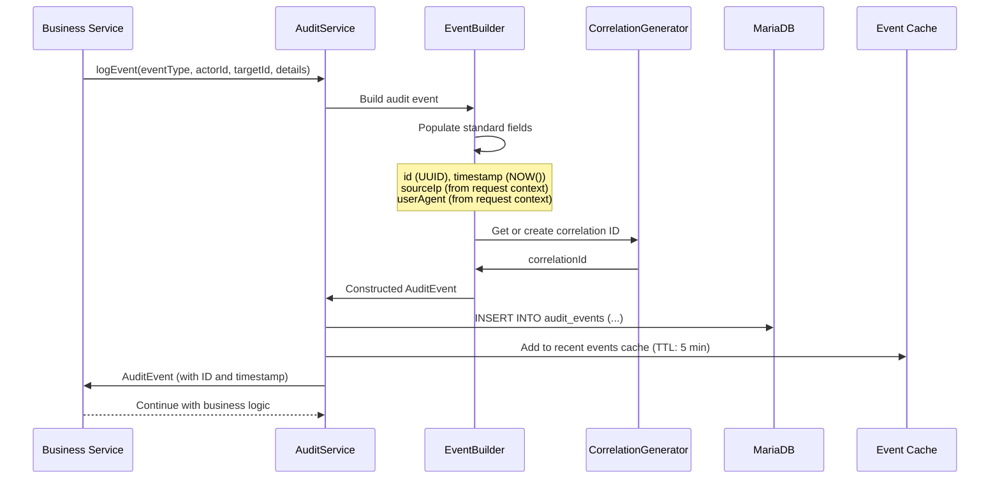

# Audit Model

## Overview

The Identity Entitlement Broker maintains an immutable audit log of every security-relevant event. The audit system provides a tamper-evident record of who did what, when, and in which tenant context, supporting compliance requirements (SOC 2, ISO 27001, GDPR) and enabling security incident investigation.

## Architecture



## Audit Event Schema

```json
{
  "id": "b7c8d9e0-f1a2-3456-bcde-789012345678",
  "eventType": "USER_CREATED",
  "tenantId": "a1b2c3d4-e5f6-7890-abcd-ef1234567890",
  "actorId": "scim-service",
  "targetId": "c3d4e5f6-a7b8-9012-cdef-123456789012",
  "details": {
    "userName": "jane.doe@example.com",
    "provisionedBy": "Azure AD SCIM",
    "externalId": "ext-jane-001"
  },
  "sourceIp": "203.0.113.42",
  "userAgent": "AzureAD-SCIM/2.0",
  "correlationId": "corr-abc-123-def",
  "immutable": true,
  "timestamp": "2025-06-30T12:00:00Z"
}
```

### Field Descriptions

| Field | Type | Description |
|---|---|---|
| `id` | UUID | Globally unique event identifier |
| `eventType` | Enum | Type of event (see below) |
| `tenantId` | UUID | Tenant context (may be null for system events) |
| `actorId` | String | Who performed the action (user email, service name, system) |
| `targetId` | String | The entity affected by the action (user ID, group ID, etc.) |
| `details` | Object | Event-specific structured data payload |
| `sourceIp` | String | Originating IP address |
| `userAgent` | String | HTTP User-Agent header |
| `correlationId` | String | Links related events across operations |
| `immutable` | Boolean | Always `true`; audit events cannot be modified |
| `timestamp` | DateTime | Server-generated, monotonically increasing |

## Event Types

### Identity Lifecycle Events

| Event Type | Description |
|---|---|
| `USER_CREATED` | SCIM user provisioned |
| `USER_UPDATED` | User attributes modified |
| `USER_DEACTIVATED` | User soft-deleted |
| `USER_DELETED` | User hard-deleted (if configured) |
| `GROUP_CREATED` | SCIM group created |
| `GROUP_UPDATED` | Group attributes or members modified |
| `GROUP_DELETED` | Group deleted |

### Entitlement Events

| Event Type | Description |
|---|---|
| `ENTITLEMENT_ASSIGNED` | Entitlement assigned to user or group |
| `ENTITLEMENT_REVOKED` | Entitlement revoked |

### Policy Events

| Event Type | Description |
|---|---|
| `POLICY_EVALUATED` | Policy decision made (allow) |
| `POLICY_DENIED` | Policy decision made (deny) |
| `ACCESS_DENIED` | Cross-tenant access attempt blocked |

### Tenant Events

| Event Type | Description |
|---|---|
| `TENANT_CREATED` | New tenant onboarded |
| `TENANT_UPDATED` | Tenant config modified |
| `TENANT_DEACTIVATED` | Tenant deactivated |

### IdP Events

| Event Type | Description |
|---|---|
| `IDP_REGISTERED` | New IdP connection added |
| `IDP_UPDATED` | IdP configuration changed |
| `IDP_REMOVED` | IdP connection removed |

### Role Mapping Events

| Event Type | Description |
|---|---|
| `ROLE_MAPPING_CREATED` | New role mapping defined |
| `ROLE_MAPPING_UPDATED` | Existing mapping modified |
| `ROLE_MAPPING_DELETED` | Mapping removed |

### Authentication Events

| Event Type | Description |
|---|---|
| `SSO_LOGIN` | Successful SSO authentication |
| `SSO_LOGIN_FAILED` | Failed SSO authentication |
| `IMPERSONATION_STARTED` | Support impersonation session began |
| `IMPERSONATION_ENDED` | Support impersonation session ended |

## Immutability Guarantees

Audit events are stored with strong immutability guarantees:

1. **No UPDATE or DELETE**: The `audit_events` table only supports INSERT operations. UPDATE and DELETE are prohibited by database triggers and application-level enforcement.
2. **Server-generated timestamps**: The `timestamp` field is set by the database server (via `NOW()` or equivalent), preventing client-side timestamp manipulation.
3. **Append-only log**: Events are strictly append-only. No compaction, deletion, or modification occurs except via the TTL retention job (see below).
4. **Hash chaining (optional)**: For enhanced tamper evidence, each event can include the hash of the previous event in the tenant's audit sequence.

## Audit Event Flow



## Query and Search

### List Audit Events

```
GET /api/v1/audit?page=0&size=20&eventType=USER_CREATED&from=2025-06-01T00:00:00Z
```

Returns paginated events for the current tenant context.

### Search Audit Events

```
POST /api/v1/audit/search
{
  "eventTypes": ["USER_CREATED", "ENTITLEMENT_ASSIGNED"],
  "actorIds": ["scim-service"],
  "from": "2025-06-01T00:00:00Z",
  "to": "2025-06-30T23:59:59Z",
  "fullText": "jane.doe",
  "page": 0,
  "size": 20
}
```

Advanced search across multiple dimensions:
- Event type filters
- Actor and target ID filters
- Date range
- Full-text search on `details` (JSON column with full-text index)
- Tenant ID filter (scoped to current context for non-admin users)

## Retention

Audit event retention is configurable per deployment:

| Environment | Retention Period | Action |
|---|---|---|
| Development | 30 days | Events deleted after TTL |
| Staging | 90 days | Events deleted after TTL |
| Production | 365+ days | Events archived to cold storage, then deleted |

The retention job runs daily and removes events older than the configured `AUDIT_RETENTION_DAYS` threshold. All deletions are logged as system audit events.

## Compliance Notes

1. **SOC 2 / ISO 27001**: The audit log satisfies requirements for monitoring access, detecting unauthorized activity, and supporting incident investigations.
2. **GDPR**: The `details` field must not contain personal data where possible. User references are by UUID, not by email or name.
3. **Audit review**: Security auditors can access the audit API with read-only permissions scoped to their tenant or globally for system-wide review.
4. **Correlation**: The `correlationId` enables tracing a single user's journey across multiple operations, useful for incident response and forensics.
