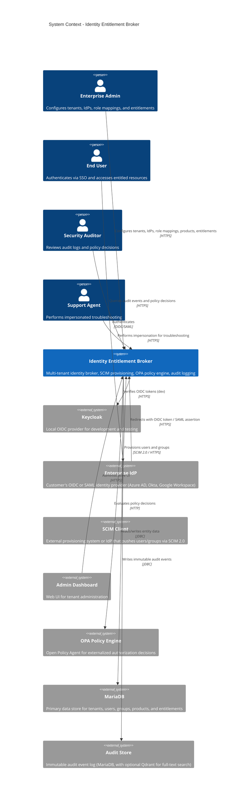

# System Context

## Overview

The Identity Entitlement Broker is a multi-tenant identity and access management platform that provides centralized SSO onboarding, SCIM-compatible user provisioning, role-based entitlement management, policy-driven access control via OPA, and an immutable audit trail. It bridges the gap between enterprise identity providers (IdPs) and application-level authorization.

## C4 System Context Diagram

## Component Roles

| Component | Role |
|---|---|
| **Identity Broker API** | Core Quarkus REST API handling all CRUD operations, SCIM provisioning, OPA policy queries, and audit logging. Enforces tenant isolation at the JAX-RS filter layer. |
| **Keycloak** | Local OIDC identity provider used for development and demo environments. Provides JWT token issuance and verification. In production, replaced by customer's enterprise IdP. |
| **Enterprise IdP** | Customer's external identity provider (Azure AD, Okta, Google Workspace, OneLogin, or any SAML 2.0 / OIDC compliant provider). Handles user authentication and provides identity claims/attributes for role mapping. |
| **SCIM Client** | External system that pushes user and group lifecycle events via the SCIM 2.0 protocol. Typically the enterprise IdP's SCIM provisioning feature, or a custom HRIS integration. |
| **Admin Dashboard** | Web-based administrative interface for managing tenants, IdP connections, role mappings, products, entitlements, and viewing audit logs. |
| **OPA (Open Policy Agent)** | Externalized policy engine that evaluates Rego policies for access decisions. Decoupled from application code, enabling audit and policy changes without re-deployment. |
| **MariaDB** | Primary relational database storing all entity data: tenants, IdP connections, users, groups, products, entitlements, assignments, role mappings, and audit events. |
| **Audit Store** | Immutable audit log within MariaDB, with event types covering every sensitive operation. Optional Qdrant vector store integration for advanced full-text semantic search. |

## Data Flow

1. **SSO Login**: End user initiates SSO → redirected to Enterprise IdP → authenticates → callback to broker with OIDC token / SAML assertion → broker extracts claims → resolves tenant context → maps roles → returns application JWT.

2. **SCIM Provisioning**: SCIM Client sends SCIM User/Group request → broker validates tenant context → transforms to internal entities → persists to MariaDB → writes audit event → returns SCIM response.

3. **Policy Decision**: API request arrives → TenantContext filter validates tenant → PolicyService builds OPA input → OPA executes Rego rules → returns allow/deny with reasoning → API enforces decision → audit event written.

4. **Audit Query**: Auditor queries audit endpoint → TenantContext filter scopes to tenant → AuditService retrieves filtered events → returns paginated, sorted results.
