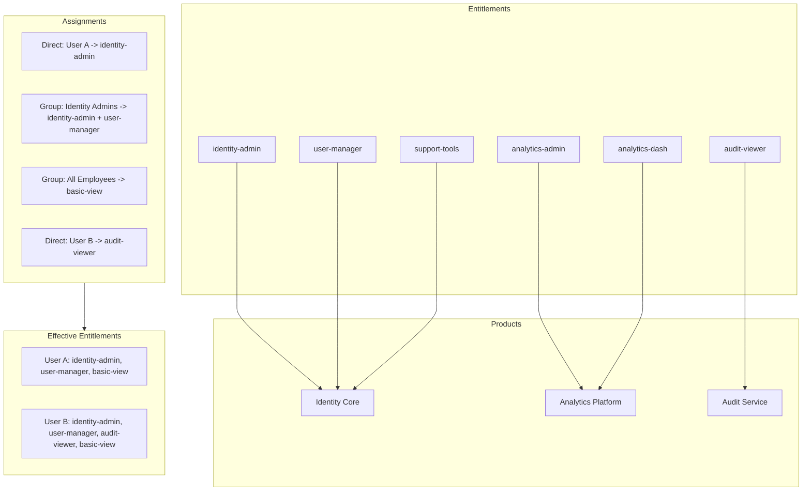
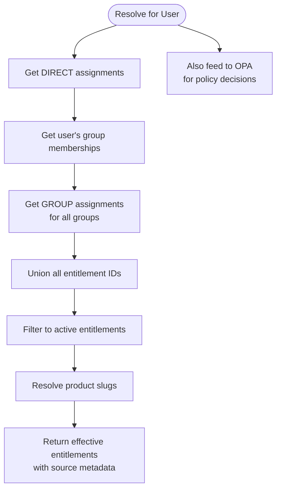
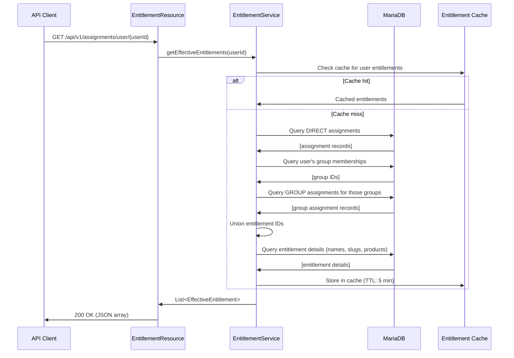

# Entitlement Resolution

## Overview

Entitlements are the atomic units of authorization in the Identity Entitlement Broker. They represent permission to perform actions on a product. The entitlement model uses a three-layer hierarchy: **Products → Entitlements → Assignments**. Users gain access through assignments (direct or group-based), and the effective set is always the union of all active assignments.

## Entitlement Model



## Hierarchy

### Product

A product represents a logical service or capability group. Examples:
- `identity-core`: Identity management services
- `analytics-platform`: Analytics and reporting
- `audit-service`: Audit log access
- `billing-service`: Billing management

### Entitlement

An entitlement is a named permission scoped to a product. Examples:
- `identity-admin` (product: `identity-core`): Full administrative access to identity services
- `user-manager` (product: `identity-core`): User provisioning and lifecycle management
- `audit-viewer` (product: `audit-service`): Read-only access to audit logs

### Assignment

An assignment links a user (or group) to an entitlement. Assignment types:

| Type | Description | Source |
|---|---|---|
| `DIRECT` | User individually assigned | Manual admin action or API |
| `GROUP` | User inherits via group membership | SCIM provisioning or IdP sync |

## Effective Entitlement Resolution

The broker resolves effective entitlements by computing the union of all active assignments for a user:



### Resolution Algorithm

```
Input: userId (UUID)
Output: List of Effective Entitlements (entitlementId, name, slug, productSlug, assignmentType)

1. DIRECT: SELECT assignments WHERE user_id = :userId AND type = 'DIRECT' AND active = true
2. GROUP:   SELECT user's group memberships
            SELECT assignments WHERE group_id IN (user's groups) AND active = true
3. UNION:   entitlement_ids = DIRECT.entitlement_ids ∪ GROUP.entitlement_ids
4. RESOLVE: SELECT entitlements WHERE id IN entitlement_ids
5. RETURN:  Map to EffectiveEntitlement DTO with type metadata
```

## Resolution Sequence



## Entitlement Evaluation in OPA

When a policy decision is requested, effective entitlements are included in the OPA input:

```json
{
  "tenant_id": "a1b2c3d4-...",
  "actor": "jane.doe@example.com",
  "subject": "jane.doe@example.com",
  "action": "access",
  "resource": "identity-core",
  "roles": ["admin"],
  "entitlements": ["identity-admin"]
}
```

The OPA policy checks whether any of the user's roles grant an entitlement that covers the requested resource product:

```rego
role_has_entitlement {
  some role
  input.roles[_] == role
  role_mapping := tenant_config.role_mappings[role]
  some entitlement
  role_mapping.entitlements[_] == entitlement
  entitlement_config := tenant_config.entitlements[entitlement]
  entitlement_config.product == input.resource
}
```

## Best Practices

1. **Prefer group-based assignments**: Group assignments scale better than individual assignments for large organizations.
2. **Limit entitlement granularity**: Create entitlements at a meaningful granularity (not too coarse, not too fine).
3. **Use descriptive slugs**: `identity-admin` is better than `ent-001` for readability and policy authoring.
4. **Document entitlement meanings**: Maintain a mapping of entitlement slug → description for auditors.
5. **Audit all changes**: Every assignment and revocation generates an immutable audit event.
