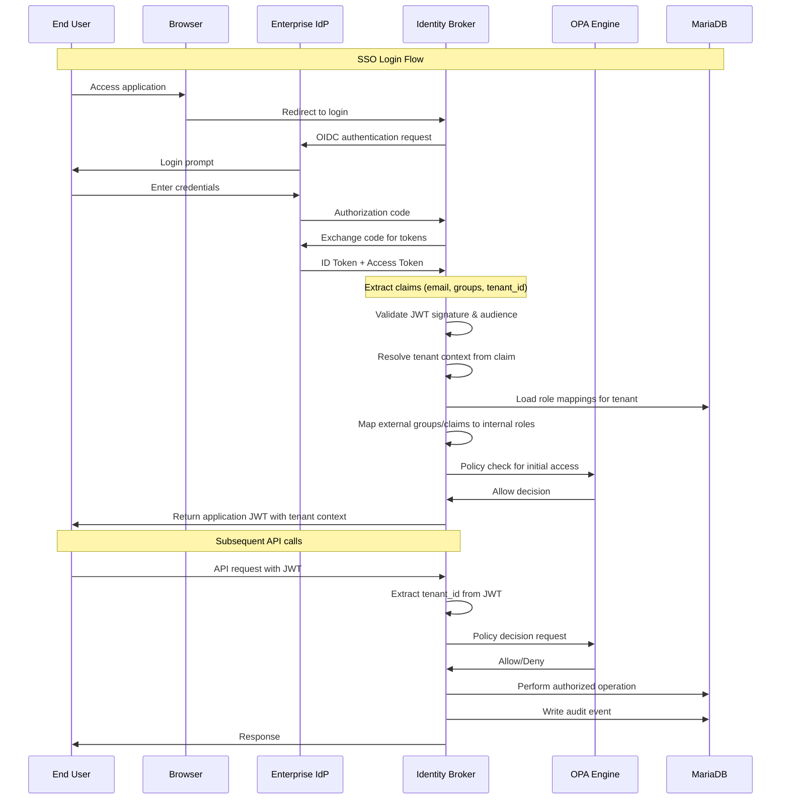
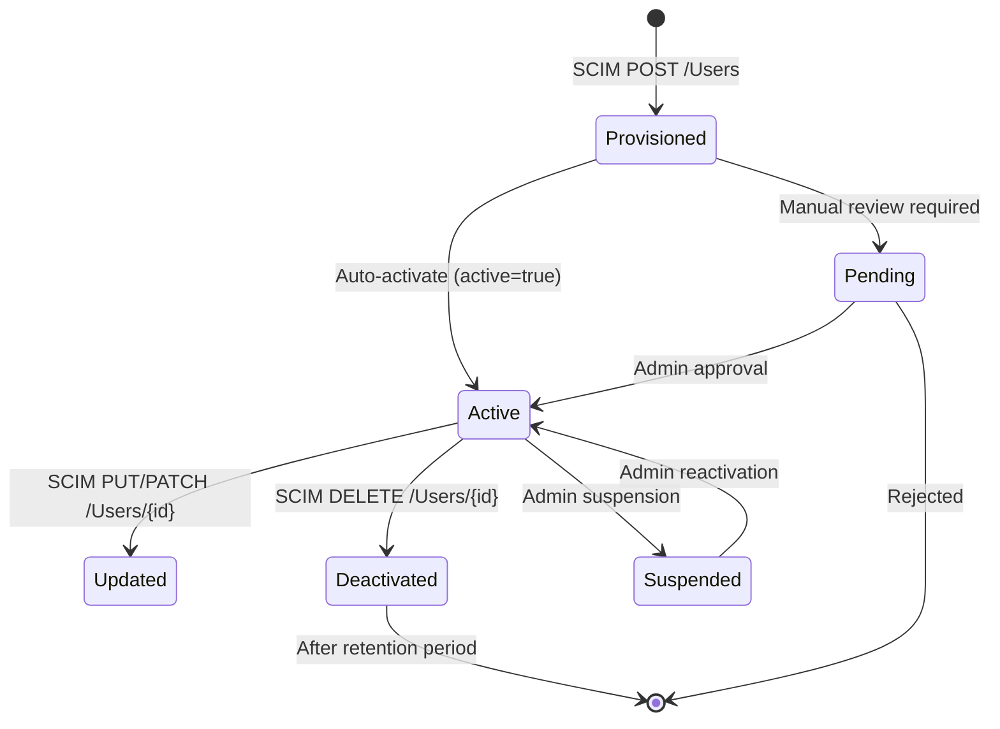

# Identity Architecture

## Overview

The Identity Entitlement Broker sits at the intersection of enterprise identity providers (IdPs) and application authorization. It decouples authentication (who you are) from authorization (what you can do) by centralizing the mapping of external identity attributes to internal roles and entitlements.

## Identity Flow Architecture



## JWT / OIDC Token Structure

The broker issues and validates JWTs with the following custom claims:

```json
{
  "sub": "c3d4e5f6-a7b8-9012-cdef-123456789012",
  "iss": "https://auth.identitybroker.example.com/realms/identity-broker",
  "aud": "identity-broker-api",
  "email": "jane.doe@example.com",
  "preferred_username": "jane.doe@example.com",
  "tenant_id": "a1b2c3d4-e5f6-7890-abcd-ef1234567890",
  "tenant_slug": "acme-corp",
  "roles": ["admin", "auditor"],
  "entitlements": ["identity-admin", "audit-viewer"],
  "idp_origin": "azure-ad-prod",
  "impersonating": false,
  "iat": 1700000000,
  "exp": 1700003600
}
```

### Claim Descriptions

| Claim | Source | Description |
|---|---|---|
| `tenant_id` | IdP claim or lookup | UUID of the resolved tenant |
| `tenant_slug` | Database | Human-readable tenant identifier |
| `roles` | Role mapping resolution | Internal roles derived from external claims |
| `entitlements` | Entitlement engine | Effective entitlements (union of direct + group-based) |
| `idp_origin` | IdP connection | Which registered IdP the user authenticated through |
| `impersonating` | Session | Set to the original actor's ID when support impersonation is active |

## IdP Provider Registry

Each tenant can register multiple identity providers. The registry stores:

- **Provider type**: OIDC or SAML
- **Issuer URL**: Unique identifier for the IdP
- **Client credentials**: Referenced via vault secrets (never stored inline)
- **JWKS URI**: For OIDC token signature verification
- **Claim mappings**: Translation of IdP-specific claim names to canonical broker attributes
- **Active/Inactive**: Soft toggle for provider enablement

## SCIM Provisioning Integration

SCIM 2.0 endpoints (`/scim/v2/Users`, `/scim/v2/Groups`) allow external systems to manage the identity lifecycle. The broker:

1. Accepts SCIM-compliant JSON payloads
2. Validates tenant context via `X-Tenant-Id` header (or JWT claim)
3. Transforms SCIM attributes to internal entity model
4. Persists to MariaDB with tenant-isolated rows
5. Logs every mutation as an immutable audit event
6. Returns SCIM-compliant responses with full metadata

**SCIM deviations from RFC 7644** are documented in [ADR-0004](../adr/0004-scim-compatible-provisioning.md).

## Role Mapping Resolution

When a user authenticates via an IdP, their external claims/attributes are resolved to internal roles via the role mapping engine:

1. **Source detection**: Identify the claim source (OIDC claim, SAML attribute, SCIM group)
2. **Mapping lookup**: Find active mappings for the tenant that match the source value
3. **Priority ordering**: Apply mappings in priority order (lower number = higher priority)
4. **Union result**: Combine all matched internal roles and entitlements
5. **Resolution output**: Produce the resolved role set for JWT embedding

## User Lifecycle



### Lifecycle Events

Every state transition generates an audit event with:
- Event type (e.g., `USER_CREATED`, `USER_UPDATED`, `USER_DEACTIVATED`)
- Actor ID (who performed the action)
- Target ID (the affected user)
- Timestamp (immutable, server-generated)
- Correlation ID (for tracing across multiple events)
- Details (snapshot of relevant data at time of event)
