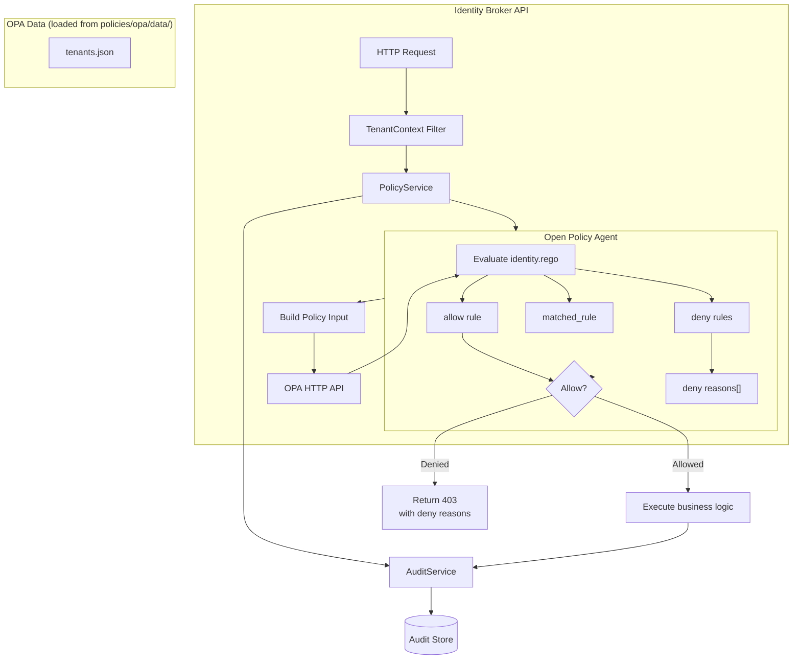
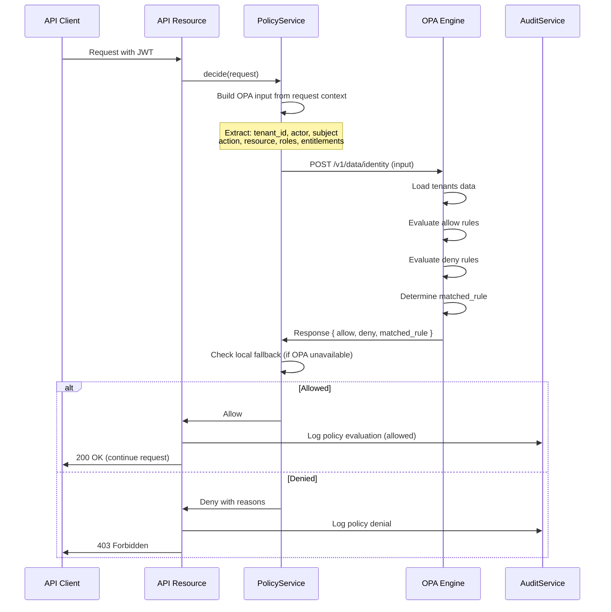

# Policy Engine

## Overview

The Identity Entitlement Broker uses Open Policy Agent (OPA) as its externalized policy engine. All authorization decisions are made by evaluating Rego policies against structured input data. This decouples policy logic from application code, enabling auditability, testability, and hot-deployment of policy changes without service restarts.

## Architecture



## Policy Structure

The OPA policy package `identity` contains the following rules:

### Package: `identity`

| Rule | Type | Description |
|---|---|---|
| `allow` | Complete (bool) | Main entry point. True if any specific allow rule passes. |
| `allow_access` | Complete (bool) | Allows access/read actions when the user has entitlement for the resource product. |
| `allow_manage` | Complete (bool) | Allows manage actions only for super-admin role. |
| `allow_impersonate` | Complete (bool) | Allows impersonation for super-admin or support-admin roles. |
| `allow_provision` | Complete (bool) | Allows provisioning for super-admin or integration roles. |
| `role_has_entitlement` | Complete (bool) | Checks if any of the user's roles map to an entitlement covering the requested resource. |
| `deny` | Set (string) | Produces human-readable reasons for denial. |
| `matched_rule` | Complete (string) | Returns the name of the matching allow rule or "denied". |

## Input Schema

The OPA policy expects the following input structure:

```json
{
  "tenant_id": "string (UUID)",
  "actor": "string (email or service ID)",
  "subject": "string (target user ID)",
  "action": "string (access|read|manage|impersonate|provision)",
  "resource": "string (product slug)",
  "roles": ["string (internal role names)"],
  "entitlements": ["string (entitlement slugs)"]
}
```

## Decision Flow



## Local Fallback

For development environments where OPA may not be running, the PolicyService includes a local fallback implementation. When `DEV_AUTH_ENABLED=true` and OPA is unreachable:

1. The fallback policy mirrors the OPA Rego logic in Java
2. It checks the same conditions: tenant active, role-based entitlement verification
3. It returns the same structured response format
4. A warning is logged indicating OPA is not being used

**Important**: The local fallback is for development only. Production deployments must always use OPA.

## Testing Policies

Policies are tested with the OPA test framework:

```bash
# Run all OPA policy tests
opa test policies/opa -v

# Run with coverage
opa test policies/opa -v --coverage

# Watch mode during development
opa test policies/opa -v --watch
```

Test files live in `policies/opa/test/` and use Rego's built-in test framework with `with input as ...` for test input and assertions.

## Best Practices

1. **Test every rule**: Each allow/deny condition should have corresponding positive and negative test cases.
2. **Use data files for complex test setups**: Keep tenant configurations in `policies/opa/data/tenants.json` for reuse across tests.
3. **Audit all decisions**: Every policy evaluation generates an audit event, regardless of allow/deny outcome.
4. **Version policies with the codebase**: OPA policies are stored in `policies/opa/` and versioned alongside the application code.
5. **Monitor OPA health**: The `/health` endpoint checks OPA connectivity and reports degradation.
6. **Keep policies stateless**: All required data should be provided in the input or loaded from data files, not fetched by OPA at evaluation time.
