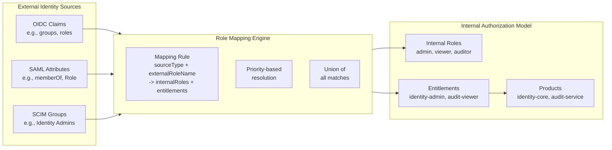
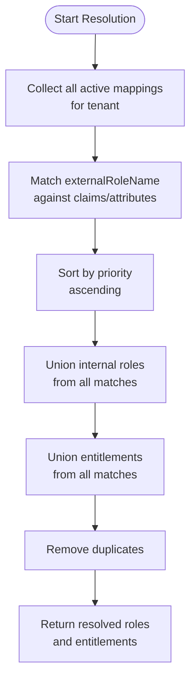

# Role Mapping

## Overview

Role mapping is the process of translating external identity attributes (OIDC claims, SAML attributes, or SCIM group memberships) into internal broker roles and entitlements. This decoupling allows the broker to present a consistent authorization model regardless of the upstream identity provider.

## Mapping Model



## Source Types

### OIDC_CLAIM

Maps claims from an OIDC ID Token or UserInfo response to internal roles.

```json
{
  "sourceType": "OIDC_CLAIM",
  "sourceValue": "groups",
  "externalRoleName": "IdentityAdministrators",
  "internalRoles": ["admin"],
  "entitlements": ["identity-admin"],
  "priority": 100
}
```

**Example claim**: `"groups": ["IdentityAdministrators", "Auditors", "Everyone"]`

**Resolution**: When a user's `groups` claim contains `"IdentityAdministrators"`, the mapping assigns them the `admin` internal role and the `identity-admin` entitlement.

### SAML_ATTRIBUTE

Maps SAML assertion attributes to internal roles.

```json
{
  "sourceType": "SAML_ATTRIBUTE",
  "sourceValue": "urn:oid:1.3.6.1.4.1.5923.1.1.1.6",
  "externalRoleName": "CN=Identity-Admins,OU=Groups,DC=acme,DC=com",
  "internalRoles": ["admin"],
  "entitlements": ["identity-admin"],
  "priority": 100
}
```

**Example attribute**: `memberOf` containing distinguished names of AD groups.

### SCIM_GROUP

Maps SCIM group membership to internal roles.

```json
{
  "sourceType": "SCIM_GROUP",
  "sourceValue": "displayName",
  "externalRoleName": "Identity Admins",
  "internalRoles": ["admin"],
  "entitlements": ["identity-admin"],
  "priority": 100
}
```

**Resolution**: When a user is a member of a SCIM group with `displayName: "Identity Admins"`, the mapping applies.

## Resolution Order

Role mapping resolution follows a defined priority and ordering system:

1. **Collect all matching mappings**: Find all active mappings for the tenant where the external claim/attribute value matches the `externalRoleName`.
2. **Sort by priority**: Lower priority numbers are evaluated first (higher precedence).
3. **Deduplicate**: Combine internal roles and entitlements from all matching mappings.
4. **Apply entitlements**: Resolve entitlement slugs to full entitlement objects (product, description, etc.).



## Example Mappings

### Standard OIDC Claim Mapping

```json
[
  {
    "sourceType": "OIDC_CLAIM",
    "sourceValue": "groups",
    "externalRoleName": "SuperAdmins",
    "internalRoles": ["super-admin"],
    "entitlements": ["identity-admin", "analytics-admin", "audit-viewer"],
    "priority": 10
  },
  {
    "sourceType": "OIDC_CLAIM",
    "sourceValue": "groups",
    "externalRoleName": "IdentityManagers",
    "internalRoles": ["admin"],
    "entitlements": ["identity-admin"],
    "priority": 50
  },
  {
    "sourceType": "OIDC_CLAIM",
    "sourceValue": "groups",
    "externalRoleName": "AllEmployees",
    "internalRoles": ["viewer"],
    "entitlements": ["basic-view"],
    "priority": 500
  }
]
```

### Priority-Based Override

Higher-priority mappings take effect even when lower-priority mappings also match. In the example above:
- A user who is both `SuperAdmins` AND `AllEmployees` will get `super-admin` role (priority 10), not `viewer` (priority 500).
- Both sets of entitlements are combined: `identity-admin`, `analytics-admin`, `audit-viewer`, and `basic-view`.

## Best Practices

1. **Use specific external role names**: Avoid wildcard or overly broad `externalRoleName` values.
2. **Assign priorities intentionally**: Reserve low priority numbers (10-100) for administrative roles, and higher numbers (500+) for default/everyone mappings.
3. **Prefer OIDC_CLAIM over SCIM_GROUP**: OIDC claims are available at authentication time without an additional SCIM lookup.
4. **Test mappings thoroughly**: Use the role mapping resolve endpoint to verify mappings before going live.
5. **Document external group naming conventions**: Coordinate with enterprise IdP administrators on group naming standards.
