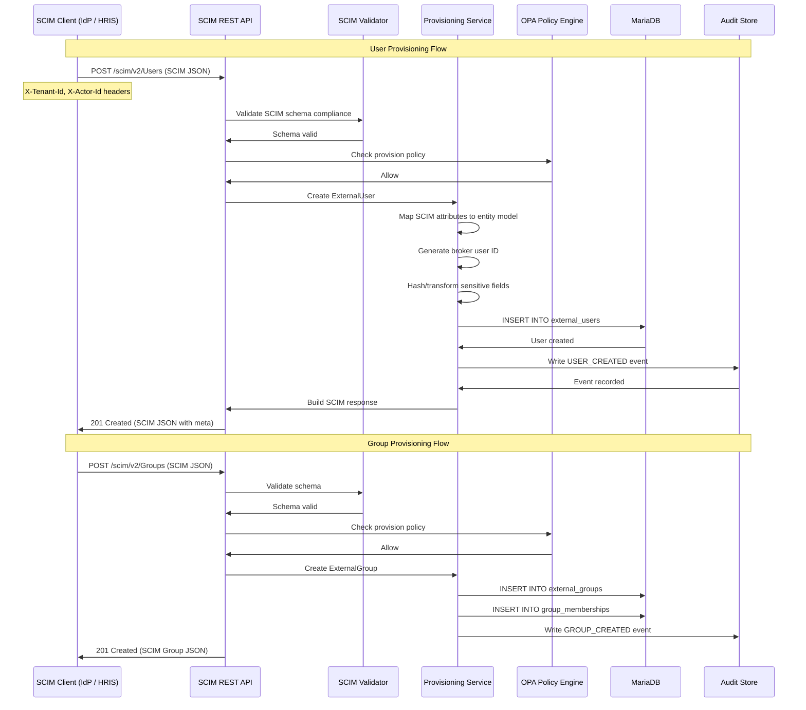

# SCIM Provisioning

## Overview

The Identity Entitlement Broker provides SCIM 2.0-compatible endpoints for user and group lifecycle management. SCIM (System for Cross-domain Identity Management) is the standard protocol for automating identity data exchange between systems. The broker's SCIM implementation enables enterprise IdPs and HRIS systems to provision, update, and deprovision users and groups programmatically.

## Provisioning Model



## Endpoint Mapping

| SCIM Endpoint | HTTP Method | Broker Endpoint | Description |
|---|---|---|---|
| `/scim/v2/Users` | POST | `ScimUserResource.createUser()` | Create a new user |
| `/scim/v2/Users` | GET | `ScimUserResource.listUsers()` | List users (with SCIM filtering) |
| `/scim/v2/Users/{id}` | GET | `ScimUserResource.getUser()` | Get user by ID |
| `/scim/v2/Users/{id}` | PUT | `ScimUserResource.updateUser()` | Full user replacement |
| `/scim/v2/Users/{id}` | PATCH | `ScimUserResource.patchUser()` | Partial user update |
| `/scim/v2/Users/{id}` | DELETE | `ScimUserResource.deleteUser()` | Deactivate user |
| `/scim/v2/Groups` | POST | `ScimGroupResource.createGroup()` | Create a new group |
| `/scim/v2/Groups` | GET | `ScimGroupResource.listGroups()` | List groups |
| `/scim/v2/Groups/{id}` | GET/PUT/PATCH/DELETE | (per resource) | Standard CRUD operations |

## Attribute Mapping

The broker maps SCIM 2.0 standard attributes to its internal entity model:

### User Attributes

| SCIM Attribute | Internal Field | Notes |
|---|---|---|
| `userName` | `username` | Primary identifier, typically email |
| `name.givenName` | `firstName` | |
| `name.familyName` | `lastName` | |
| `displayName` | `displayName` | |
| `emails[primary=true].value` | `email` | Primary email used for notifications |
| `active` | `active` | If false, user is deactivated |
| `externalId` | `externalId` | IdP's immutable user identifier |
| `groups[].value` | (group memberships) | Resolved and stored as `GroupMembership` entities |

### Group Attributes

| SCIM Attribute | Internal Field | Notes |
|---|---|---|
| `displayName` | `displayName` | Group name shown in UI |
| `externalId` | `externalId` | IdP's immutable group identifier |
| `members[].value` | (memberships) | User UUIDs that belong to this group |

## Schema Compliance Notes

The broker's SCIM implementation aims for practical compatibility rather than strict RFC 7644 compliance. Key deviations:

1. **Attribute extensions**: Custom schema extensions (`urn:ietf:params:scim:schemas:extension:enterprise:2.0:User`) are not implemented.
2. **Filter syntax**: Only a subset of SCIM filter expressions are supported (`eq`, `co`, `sw` operations on `userName`, `displayName`, `active`).
3. **Pagination**: Uses `startIndex` and `count` parameters (SCIM standard) rather than the internal `page`/`size` pattern.
4. **Bulk operations**: `/scim/v2/Bulk` is not implemented. Each provisioning operation is handled individually.
5. **Password management**: The broker does not manage passwords; authentication is handled by the external IdP.

## Lifecycle Events

| Event Type | Trigger | Description |
|---|---|---|
| `USER_CREATED` | POST `/Users` | New user provisioned |
| `USER_UPDATED` | PUT/PATCH `/Users/{id}` | User attributes modified |
| `USER_DEACTIVATED` | DELETE `/Users/{id}` | User soft-deleted (active=false) |
| `USER_REACTIVATED` | PATCH setting `active=true` | Previously deactivated user restored |
| `GROUP_CREATED` | POST `/Groups` | New group created |
| `GROUP_UPDATED` | PUT/PATCH `/Groups/{id}` | Group attributes or members modified |
| `GROUP_DELETED` | DELETE `/Groups/{id}` | Group soft-deleted |

Every lifecycle event produces an immutable audit record with:
- Event type, timestamp (server-generated), actor ID, target ID
- Snapshot of the entity state after the operation
- Correlation ID linking related events (e.g., group creation and member additions)
- Source IP and user-agent of the provisioning caller

## Error Handling

SCIM errors follow the SCIM error schema:

```json
{
  "schemas": ["urn:ietf:params:scim:api:messages:2.0:Error"],
  "status": "409",
  "detail": "User with userName 'jane.doe@example.com' already exists in this tenant",
  "scimType": "uniqueness"
}
```

Common error scenarios:
- **409 Conflict**: Duplicate `userName` within the same tenant
- **400 Bad Request**: Malformed SCIM JSON or invalid attribute values
- **404 Not Found**: User/Group ID does not exist (tenant-scoped)
- **403 Forbidden**: Actor lacks provisioning entitlement (provisioning role required)
