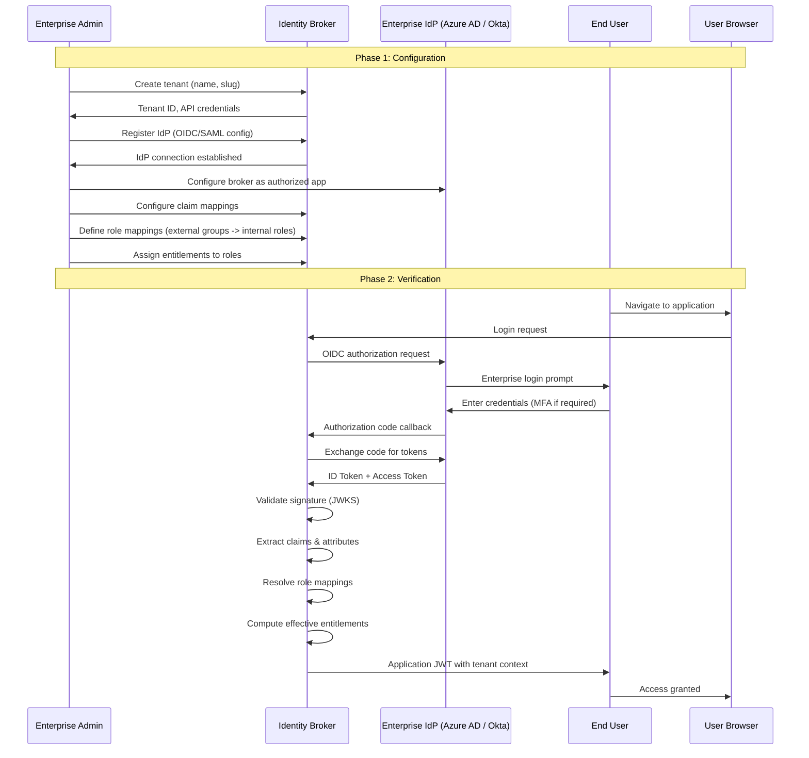
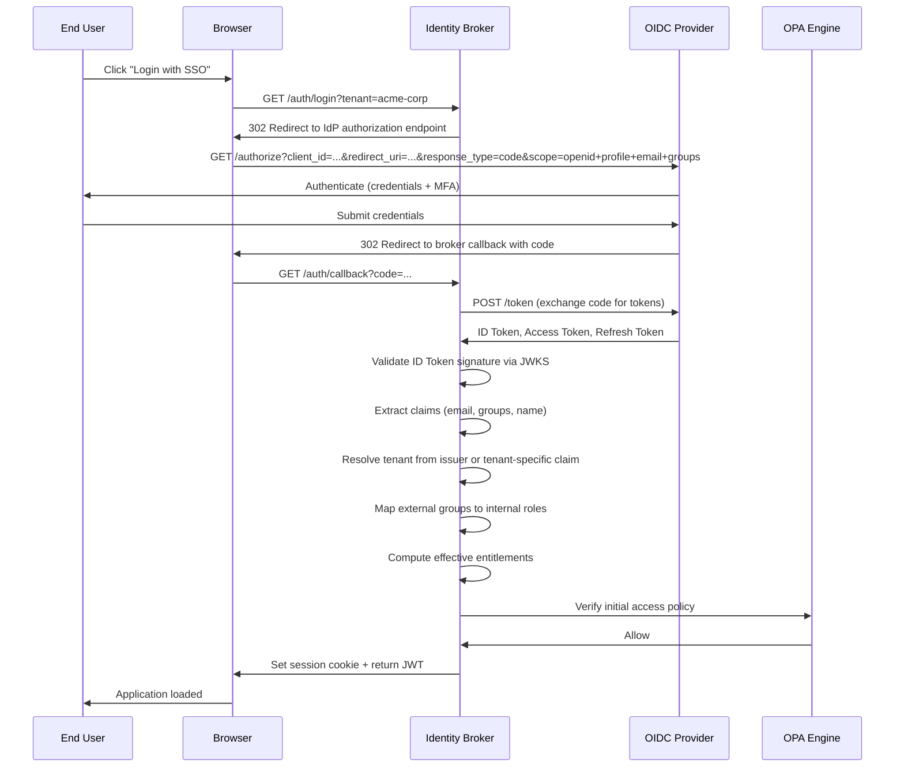

# SSO Onboarding

## Overview

Single Sign-On (SSO) onboarding is the process of connecting an enterprise tenant's identity provider to the Identity Entitlement Broker. This enables users to authenticate via their corporate IdP and receive appropriate access entitlements based on their group membership or directory attributes.

## Onboarding Flow



## Step-by-Step Onboarding Process

### 1. Create Tenant

The enterprise admin creates a tenant in the broker:

```
POST /api/v1/tenants
{
  "name": "Acme Corporation",
  "slug": "acme-corp",
  "metadata": {
    "region": "us-east-1",
    "tier": "enterprise"
  }
}
```

**Response**: Tenant UUID, API credentials, and initial configuration state.

### 2. Register Identity Provider

Register the enterprise's IdP connection:

```
POST /api/v1/tenants/{tenantId}/idp
{
  "providerType": "OIDC",
  "issuer": "https://login.microsoftonline.com/{tenant-id}/v2.0",
  "clientIdRef": "vault://acme/azure-ad-client-id",
  "secretRef": "vault://acme/azure-ad-client-secret",
  "jwksUri": "https://login.microsoftonline.com/{tenant-id}/discovery/v2.0/keys",
  "ssoLoginUrl": "https://login.microsoftonline.com/{tenant-id}/oauth2/v2.0/authorize",
  "claimMappings": {
    "sub": "externalId",
    "email": "email",
    "name": "displayName",
    "groups": "groupMembership"
  },
  "active": true
}
```

### 3. Configure Role Mappings

Map external groups/roles to internal entitlements:

```
POST /api/v1/tenants/{tenantId}/role-mappings
{
  "sourceType": "OIDC_CLAIM",
  "sourceValue": "groups",
  "externalRoleName": "IdentityAdministrators",
  "internalRoles": ["admin"],
  "entitlements": ["identity-admin"],
  "priority": 100,
  "active": true
}
```

### 4. Configure IdP Application

On the enterprise IdP side, configure the broker's callback URL:
- **OIDC**: Redirect URI → `https://broker.example.com/api/v1/auth/callback/{tenantId}`
- **SAML**: ACS URL → `https://broker.example.com/saml2/acs/{tenantId}`

### 5. Test SSO

1. Navigate to the broker's login endpoint for the tenant
2. Verify redirect to enterprise IdP
3. Complete authentication (username/password + MFA)
4. Verify successful callback and JWT issuance
5. Check that role mappings are correctly resolved
6. Verify entitlement-driven access to protected resources

## OIDC Flow Details



## SAML Extension Path

SAML 2.0 support follows the same conceptual flow with protocol-specific differences:

| Aspect | OIDC | SAML |
|---|---|---|
| **Metadata exchange** | Well-known URL (`.well-known/openid-configuration`) | XML metadata document (metadata URL or file) |
| **Auth request** | HTTP 302 redirect with query params | HTTP Redirect or POST binding with XML AuthnRequest |
| **Response** | Authorization code (code flow) or token (implicit) | XML SAML Response with Assertion |
| **Signature verification** | JWKS endpoint | X.509 certificate in metadata |
| **Attribute format** | JSON claims | SAML attributes (urn:oid URIs or custom names) |
| **Logout** | RP-initiated or IdP-initiated via end_session_endpoint | Single Logout Service (SLO) |

To configure SAML, set `providerType: "SAML"` and provide `metadataUrl` and `attributeMappings` instead of `claimMappings`.

## Enterprise Tenant Setup Checklist

- [ ] Tenant created with correct name, slug, and tier
- [ ] IdP registered with valid issuer and client credentials
- [ ] Claim mappings configured correctly
- [ ] Role mappings defined for all external groups
- [ ] Entitlements assigned to roles
- [ ] IdP application configured with correct callback URLs
- [ ] Test user authenticated successfully via SSO
- [ ] Role resolution verified against test user's group membership
- [ ] Policy decisions correctly enforce entitlements
- [ ] Audit events captured for login and policy evaluations
