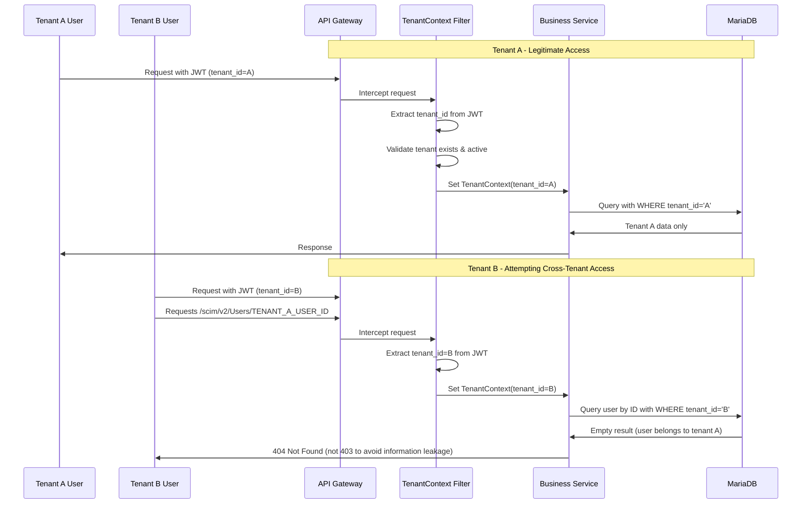
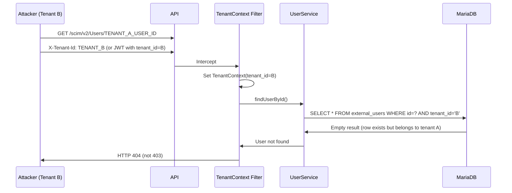

# Tenant Isolation

## Overview

Multi-tenant isolation is a foundational security requirement for the Identity Entitlement Broker. Every request must operate strictly within the bounds of a single tenant context. The broker enforces isolation at the application layer, ensuring that even if database-level security is compromised, tenant boundaries are maintained.

## Isolation Model

## Enforcement Points

### 1. Request-Level Filter (`@RequestScoped TenantContext`)

Every API request passes through a JAX-RS `ContainerRequestFilter` that:

1. Extracts the tenant context from:
   - JWT `tenant_id` claim (production)
   - `X-Tenant-Id` header (development mode, only when `DEV_AUTH_ENABLED=true`)
2. Validates that the tenant exists and is active
3. Sets a `@RequestScoped` CDI bean holding the current tenant context
4. Rejects the request with HTTP 401/403 if tenant context is invalid or missing

### 2. Repository-Level Scoping

Every JPA repository query automatically includes a `tenant_id` predicate. This is enforced through:

- **Panache repository base class**: All entity repositories extend a base that injects the current tenant context
- **Query methods**: Custom queries include `WHERE tenant_id = :tenantId`
- **Native queries**: Parameterized with tenant context
- **Entity relationships**: Cross-tenant foreign keys are validated on creation

### 3. Service-Level Validation

Business services perform explicit tenant checks before operations:

- **Idempotency checks**: Verify the target resource belongs to the tenant
- **SCIM provisioning**: Validate tenant header matches the tenant of the provisioned user
- **Role mapping operations**: Scope to the tenant's role mapping set
- **Policy decisions**: Include tenant ID in the OPA input for tenant-scoped policy evaluation

## Entities with Tenant Isolation

The following entities have a `tenant_id` column and are fully tenant-scoped:

| Entity | Tenant Column | Notes |
|---|---|---|
| `ExternalUser` | `tenant_id` | SCIM-provisioned users |
| `ExternalGroup` | `tenant_id` | SCIM-provisioned groups |
| `GroupMembership` | `tenant_id` | Via group relationship |

## Global Entities (Not Tenant-Scoped)

These entities are system-wide and require `manage` or `super-admin` role to access:

| Entity | Access Control |
|---|---|
| `Tenant` | Requires `super-admin` role |
| `Product` | Requires `admin` or `manage` role |
| `Entitlement` | Requires `admin` or `manage` role |
| `SystemAuditEvent` | Scoped by tenant context, but system admins can access all |

## Cross-Tenant Access Detection

The broker detects and handles cross-tenant access attempts:

1. **Direct resource access**: Requests for a specific resource ID that belongs to a different tenant → returns `404 Not Found` (tenant-agnostic error, prevents enumeration)
2. **List operations**: Automatically scoped to the current tenant via repository-level filters
3. **Reference by external ID**: External IDs are unique per tenant, preventing cross-tenant collision
4. **Bulk operations**: Validated at the service layer before any mutations are made

## Sequence: Cross-Tenant Rejection

## Best Practices

1. **Never leak tenant existence**: Always return `404 Not Found` for cross-tenant access, never `403` (which would confirm the resource exists in another tenant).
2. **Validate before mutation**: Always re-validate tenant context before write operations.
3. **Audit all denials**: Log every rejected cross-tenant access attempt as an audit event.
4. **Test isolation boundaries**: Include dedicated cross-tenant tests in every deployment pipeline.
5. **Defense in depth**: Apply tenant isolation at the application layer even if database views or row-level security are also configured.
